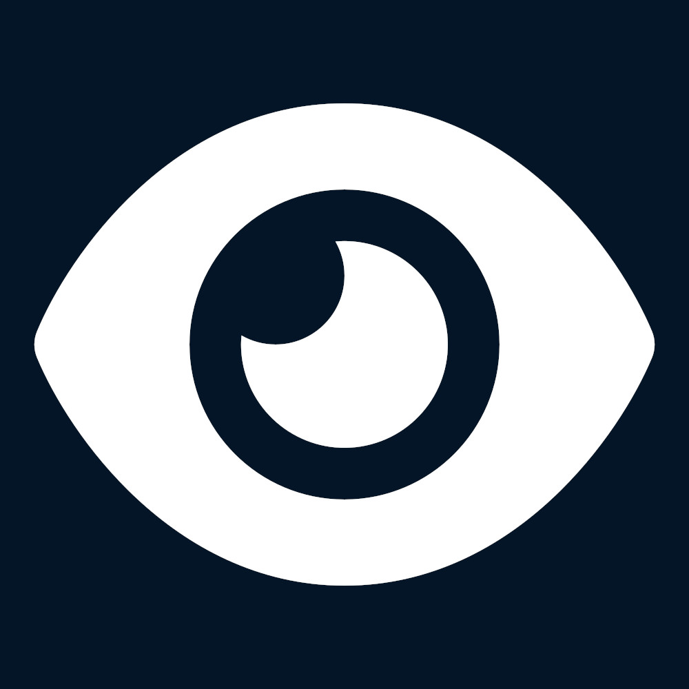

<div id="title" align="center">
    
    <h1>EYE-TAP</h1>
</div>

A platform to connect gaze points to bounding boxes of texts.
Deployed version can be found [here](https://eyetap.ivia.ch/)

# Installation
## Docker
The `docker-compose.yml` provided in the main folder in this repo is configured to pull in the latest docker containers provided by this project.

Run `docker compose up` in the root folder of this repository

## Kubernetes / Helm
Clone the [helm chart repo](https://github.com/eye-tap/helm-chart) and either run the `kube-deploy.sh` script,
or use one of the provided CI pipelines (for GitHub Actions and Gitlab CI) to create a deployment.


## Monorepo
To run the backend for development, run `docker compose up` in the `/dev` folder
This repo uses submodules to pull in the frontend and backend.
So, when cloning, use
```git clone --recursive https://github.com/eye-tap/eyetap```

or, if you forget, you can clone the submodules using
```git submodule --recursive --remote --init```

and you can pull changes to them using either the provided `update-repo.sh` script or
```git submodule --remote --recursive```


## License

EYE-TAP
Copyright (C) 2026  EYE-TAP contributors

This program is free software: you can redistribute it and/or modify it under the terms of the GNU Affero General Public License as published by the Free Software Foundation, either version 3 of the License, or (at your option) any later version.

This program is distributed in the hope that it will be useful, but WITHOUT ANY WARRANTY; without even the implied warranty of MERCHANTABILITY or FITNESS FOR A PARTICULAR PURPOSE.  See the GNU Affero General Public License for more details.

You should have received a copy of the GNU Affero General Public License along with this program.  If not, see <http://www.gnu.org/licenses/>.
